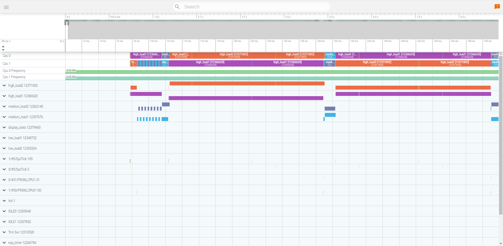

# SysView Perfetto Converter
[Segger SystemView](https://www.segger.com/products/development-tools/systemview/) is a system behavior analyzer, it shows the running task and timing in the system and can help find delays and tasks that hog the MCU. The ESP-IDF framework uses SystemView embedded component and OpenOCD to generate trace data for SystemView to display, However, Segger SystemView was not designed to view more than one core and some modules of ESP32 [have two cores](https://docs.espressif.com/projects/esp-idf/en/latest/esp32/api-guides/app_trace.html#data-visualization) which makes it less than an ideal tool.

Another alternative would be to use [toem Impulse](https://docs.espressif.com/projects/esp-idf/en/latest/esp32/api-guides/app_trace.html#configure-impulse-for-dual-core-traces), but Installing Eclipse just for that seemed like an overkill for me.

After looking at a few tools I've found [Perfetto](https://perfetto.dev/) for working with Linux trace files, which made it a candidate for showing SystemView data as well and it can handle multiple cores, complex events and interrupts and metrics.



# SYSVIEW_FreeRTOS.txt
The `SYSVIEW_FreeRTOS.txt` specifies the trace function and arguments for the sysview decoder. On the other end there is the `SEGGER_SYSVIEW_FreeRTOS.h` and possibly `SEGGER_SYSVIEW_RegisterModule` for additional modules.

# Usage

## Installing
```bash
pip install -r requirements.txt
```

```bash
python tracer.py -i samples/app-cpu.svdat -i samples/pro-cpu.svdat --dump_input svdat_dump.json -p cpu_ftrace --dump_ftrace_json cpu_ftrace.json
python tracer.py -i samples/app-cpu1.svdat -i samples/pro-cpu1.svdat --dump_input svdat_dump1.json -p cpu_ftrace1 --dump_ftrace_json cpu_ftrace1.json
python tracer.py -i samples/app-cpu2.svdat -i samples/pro-cpu2.svdat --dump_input svdat_dump2.json -p cpu_ftrace2 --dump_ftrace_json cpu_ftrace2.json
python tracer.py -i samples/app-cpu3.svdat -i samples/pro-cpu3.svdat --dump_input svdat_dump3.json -p cpu_ftrace3 --dump_ftrace_json cpu_ftrace3.json
```

# Missing Features
- Tracing Custom Metric is not currently supported. Both Sysview and Perfetto supports metrics.

# Alternatives
- Use Two instances of Segger SystemView, one for each core
- Use [toem Impulse](https://mcuoneclipse.com/2016/07/31/impulse-segger-systemview-in-eclipse/) to view multiple traces side by side
- Use [Percepio Tracealyzer](https://www.freertos.org/FreeRTOS-Plus/FreeRTOS_Plus_Trace/FreeRTOS_Plus_Trace.html)


# License
This library is free for use for open source and hobbyist.

# Disclaimer
```
THIS SOFTWARE OR SUPPORT IS PROVIDED BY THE COPYRIGHT HOLDERS AND CONTRIBUTORS
"AS IS" AND ANY EXPRESS OR IMPLIED WARRANTIES, INCLUDING, BUT NOT LIMITED TO,
THE IMPLIED WARRANTIES OF MERCHANTABILITY AND FITNESS FOR A PARTICULAR PURPOSE ARE DISCLAIMED.
IN NO EVENT SHALL THE COPYRIGHT HOLDER OR CONTRIBUTORS BE LIABLE FOR ANY DIRECT,
INDIRECT, INCIDENTAL, SPECIAL, EXEMPLARY, OR CONSEQUENTIAL DAMAGES
(INCLUDING, BUT NOT LIMITED TO, PROCUREMENT OF SUBSTITUTE GOODS OR SERVICES; LOSS OF USE, DATA, OR PROFITS; OR BUSINESS INTERRUPTION)
HOWEVER CAUSED AND ON ANY THEORY OF LIABILITY, WHETHER IN CONTRACT, STRICT LIABILITY,
OR TORT (INCLUDING NEGLIGENCE OR OTHERWISE) ARISING IN ANY WAY OUT OF THE USE OF THIS SOFTWARE OR SUPPORT,
EVEN IF ADVISED OF THE POSSIBILITY OF SUCH DAMAGE.
```